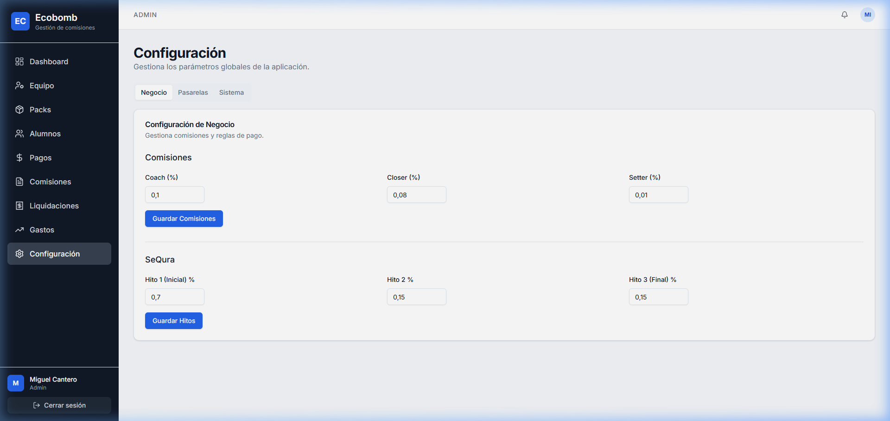
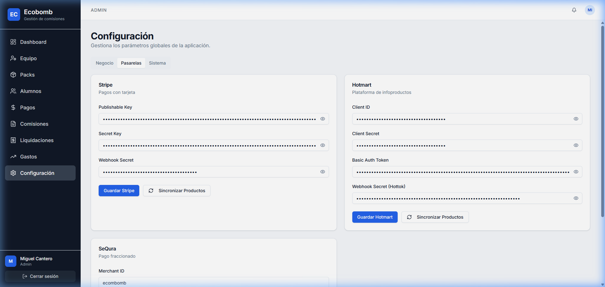
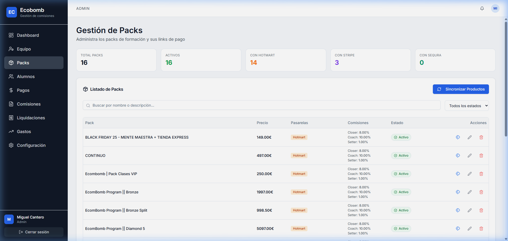
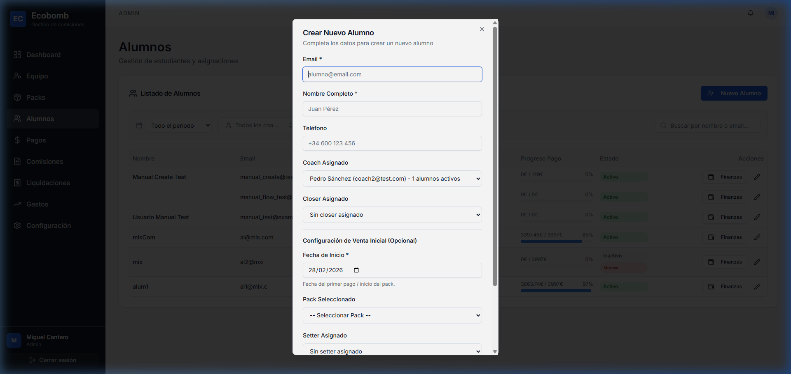
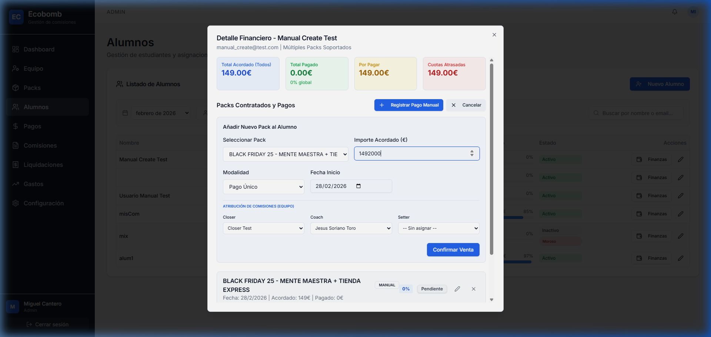
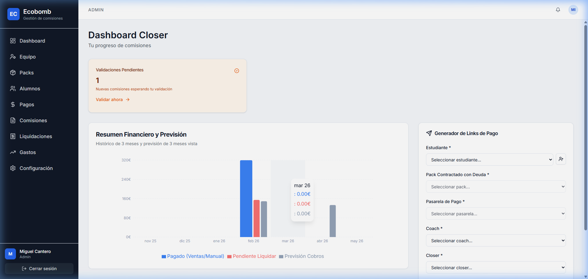
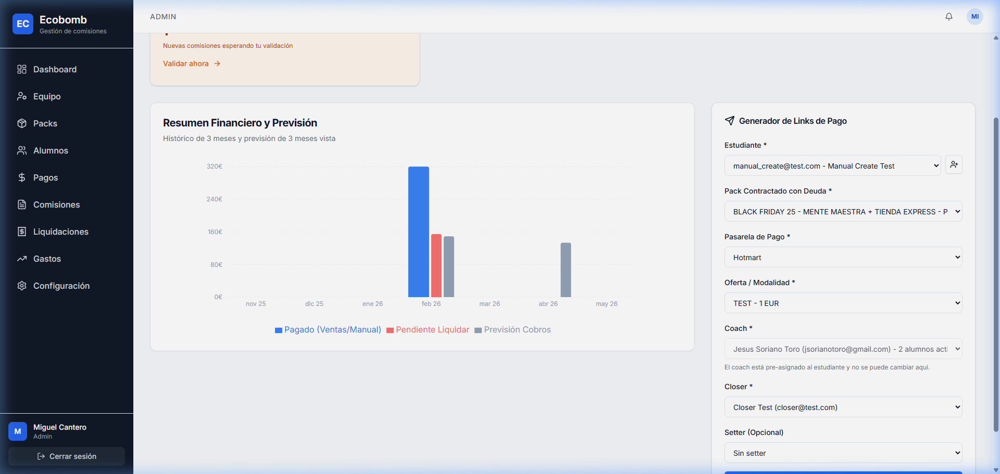
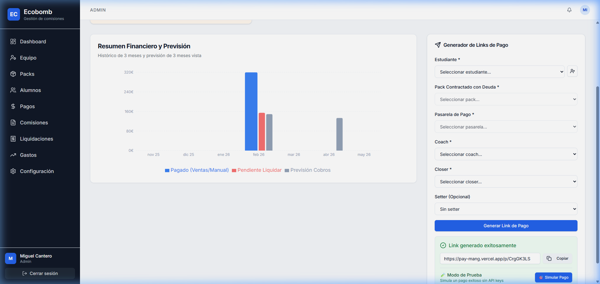
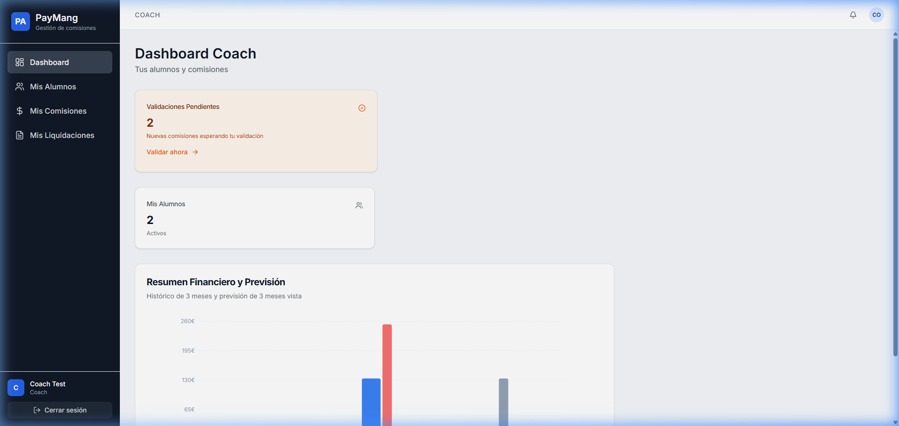
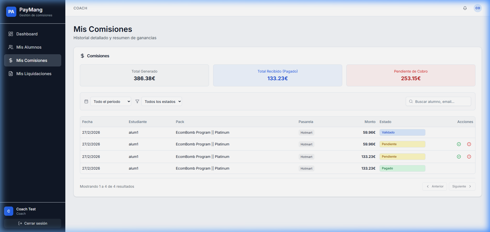

# 📘 Manual de Usuario Maestro: EcoBomb - Gestion comisiones
Este manual proporciona una guía técnica y operativa exhaustiva para la gestión de alumnos, ventas, comisiones y configuración del sistema. Diseñado para ofrecer claridad absoluta a cada rol (Admin, Closer, Coach, Setter).

---

## 📌 Índice de Contenidos
1. [👑 ADMINISTRADOR: Configuración y Gestión Maestra](#1-administrador)
   - [Configuración de Negocio y Pasarelas](#configuracion-de-negocio)
   - [Sincronización y Gestión de Packs](#gestion-de-packs)
   - [Gestión de Alumnos y Asignación de Packs (Finanzas)](#gestion-de-alumnos)
2. [🚀 CLOSER: Generación de Ventas](#2-closer)
   - [Uso del Generador de Links Unificado](#generador-de-links)
3. [🎓 COACH: Gestión de Alumnos y Validación](#3-coach)
   - [Visibilidad y Validación de Comisiones](#validacion-coach)
4. [🎯 SETTER: Atribución de Ventas](#4-setter)
5. [🛠️ Solución de Problemas (FAQ)](#5-faq)

---

## 1. 👑 ADMINISTRADOR: Configuración y Gestión Maestra 

### A. Configuración de Negocio y Pasarelas 
El administrador define las reglas del juego. En el panel de **Configuración**, se gestionan los porcentajes de comisión base y la conectividad con Stripe/Hotmart.

*Pantalla de configuración de porcentajes por rol.*

*Panel de sincronización con Stripe y Hotmart.*

### B. Sincronización y Gestión de Packs 
Los packs **no se crean manualmente**; se sincronizan directamente desde las pasarelas para asegurar la integridad de los precios.
- **Acción:** Haga clic en `Sincronizar Productos` para importar las últimas ofertas.
- **Ofertas:** Puede cambiar el `Offer ID` o `Price ID` de un pack existente para ajustar promociones.

*Vista general de packs activos en el sistema.*

### C. Gestión de Alumnos y Asignación de Packs (Finanzas) 
#### I. Añadir Alumno con Pack Inicial
Al crear un alumno, puede asignar su primer pack en la sección "Configuración de Venta Inicial".

#### II. Añadir Pack a Alumno Existente (Botón Finanzas)
Si un alumno ya existe y desea añadirle un nuevo programa de mentoría, debe usar el botón **Finanzas** en la lista de alumnos.

*Proceso de asignación manual de un segundo pack a un alumno.*

---

## 2. 🚀 CLOSER: Generación de Ventas 

### Uso del Generador de Links Unificado 
El Closer es responsable de cerrar las ventas utilizando el **Generador de Links**.
1. Seleccione el **Alumno** (debe tener un pack asignado previamente por Admin).
2. Seleccione el **Pack** correspondiente.
3. Elija la **Pasarela** (Stripe/Hotmart).
4. El sistema generará un enlace único y un QR para el cliente.

<!-- slide -->

<!-- slide -->

---

## 3. 🎓 COACH: Gestión de Alumnos y Validación 

### Visibilidad y Validación de Comisiones 
El Coach solo visualiza a los alumnos que tiene asignados (Segregación de datos). Su tarea crítica es **validar el hito de mentoría** para desbloquear su comisión.

*Vista restringida del Coach.*

*Botones de acción para validar o reportar incidencias en comisiones pendientes.*

---

## 4. 🎯 SETTER: Atribución de Ventas 
El Setter tiene una vista centrada en su rendimiento. En su dashboard, puede ver qué ventas se le han atribuido y el estado de sus comisiones (normalmente el 1% del total).

---

## 5. 🛠️ Solución de Problemas (FAQ) 

- **¿Por qué no puedo generar un link?** Asegúrese de que el alumno tenga al menos un pack asignado (vía Botón Finanzas).
- **El Dashboard no muestra datos nuevos:** Verifique la sincronización en `Configuración > Pasarelas`. El sistema procesa webhooks en tiempo real, pero la sincronización de productos es manual.
- **Error al logear con otro rol:** Recuerde siempre **Cerrar Sesión** completamente. El navegador puede recordar credenciales previas; limpie los campos antes de escribir los nuevos.

---
